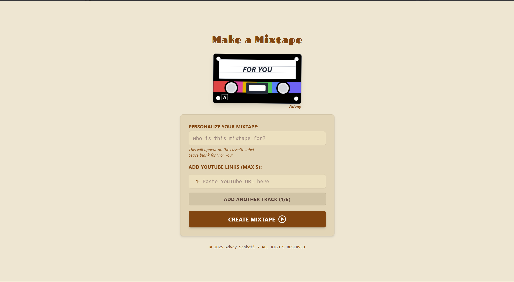

# 🎵 The Mixtape Project - Retro Music Experience

**The Mixtape Project** is a nostalgic, **retro-themed** web app that lets users **create, play, share, and remix mixtapes**. It simulates the feel of **classic cassette tapes** while incorporating modern digital features like cloud storage, seamless audio playback, and social sharing.

🚀 **Live Demo**: [Mixtape Project](https://mixtape-pi.vercel.app/)

---

## 📌 Features

✅ **Retro-Themed UI** – Styled like a classic cassette player with animated reels  
✅ **Custom Mixtapes** – Users can add tracks, arrange them, and customize labels  
✅ **Seamless Audio Playback** – Smooth playback transitions via YouTube iFrame API  
✅ **Firebase Integration** – Mixtapes are securely stored & can be revisited anytime  
✅ **Social Sharing** – Generate & share unique mixtape links with friends  
✅ **Remix Mode** – Users can modify & create their own versions of shared mixtapes  
✅ **Fully Responsive** – Optimized for desktop & mobile devices

---

## 🎨 Screenshots

| Page Name          | Screenshot                              |
| ------------------ | --------------------------------------- |
| **Create Mixtape** |       |
| **Play Mixtape**   |  |
| **Remix Mixtape**  |  |

---

## 🏗 Tech Stack

- **Frontend**: React.js + Vite.js
- **UI Design**: Tailwind CSS
- **Database**: Firebase Firestore
- **Authentication**: Firebase Auth
- **Audio Playback**: YouTube iFrame API

---

## 🚀 Installation & Setup

### 1️⃣ Clone the Repository

```sh
git clone https://github.com/AdvaySanketi/Mixtape.git
cd Mixtape
```

### 2️⃣ Install Dependencies

```sh
npm install
```

### 3️⃣ Set Up Environment Variables

Create a `.env.local` file in the root directory and add the required Firebase credentials:

```sh
VITE_FIREBASE_API_KEY=your_api_key
VITE_FIREBASE_AUTH_DOMAIN=your_auth_domain
VITE_FIREBASE_PROJECT_ID=your_project_id
VITE_FIREBASE_STORAGE_BUCKET=your_storage_bucket
VITE_FIREBASE_MESSAGING_SENDER_ID=your_sender_id
VITE_FIREBASE_APP_ID=your_app_id
```

### 4️⃣ Run the Development Server

```sh
npm run dev
```

The project should now be running on **[http://localhost:3000](http://localhost:3000/)** 🚀

---

## 🔍 How It Works

### **Creating a Mixtape**

- Add songs via YouTube links
- Customize the mixtape title & design
- Save & generate a **unique link** to share

### **Playing a Mixtape**

- **Load the Mixtape** into the cassette
- The app **automatically plays** YouTube videos from the mixtape
- Users can **play, pause, and skip** songs
- The UI **mimics a classic cassette player**, with animated reels and buttons

### **Remixing a Mixtape**

- Users can **modify an existing mixtape**
- Changes are saved under the **the Mixtape ID**

---

## **Performance Optimizations**

✔ **Lazy Loading** – Mixtape data is fetched only when needed  
✔ **Vite.js Optimization** – Ensures faster builds & hot module replacement  
✔ **CSS Animations** – Smooth cassette reel spinning effect without re-renders

---

## 🤝 Contributing

Contributions are welcome! To contribute:

1. **Fork** this repository
2. **Create a new branch**:
   ```sh
   git checkout -b feature/AmazingFeature
   ```
3. **Commit your changes**:
   ```sh
   git commit -m 'Add some AmazingFeature'
   ```
4. **Push to the branch**:
   ```sh
   git push origin feature/AmazingFeature
   ```
5. **Open a Pull Request** 🚀

---

## 📝 License

Distributed under the MIT License. See [LICENSE](LICENSE) for more information.

---

## 🆘 Support

Having trouble? Want to request a feature? Here's how you can get help:

- Open an issue.
- Contact the maintainer: [Advay Sanketi](https://advay-sanketi-portfolio.vercel.app/)

---

🎵 _Bringing back the mixtape culture with modern web tech!_ 🚀
